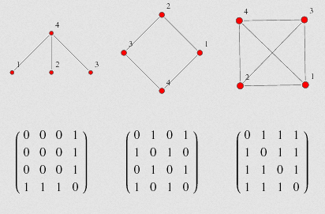
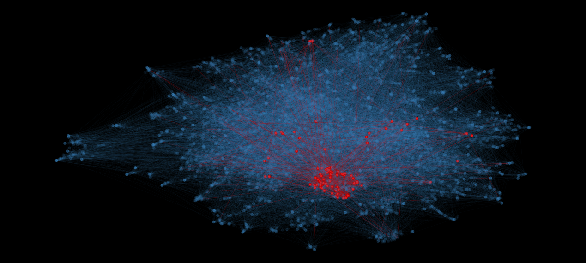
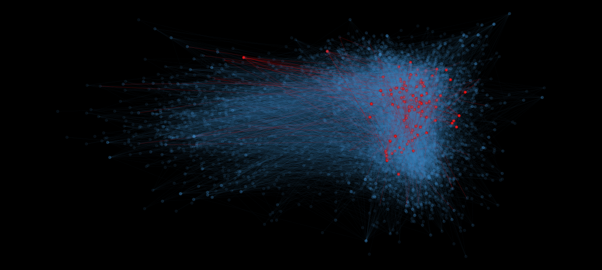
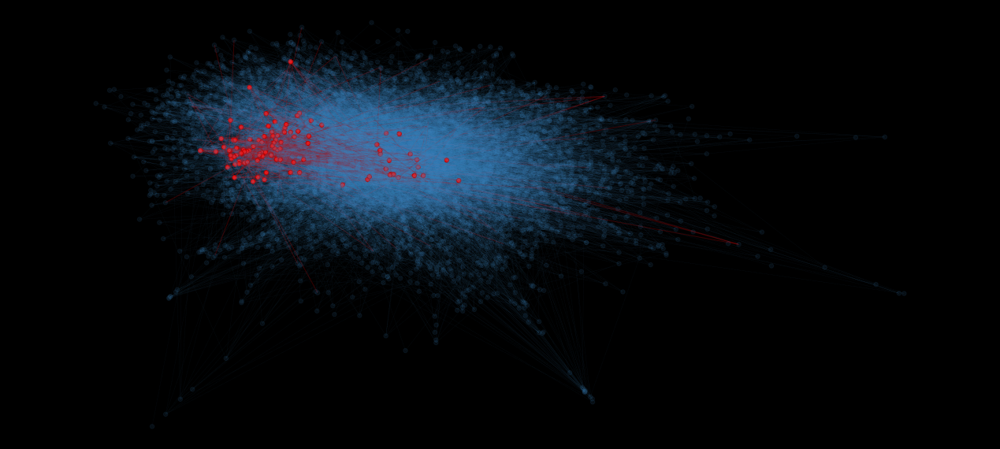
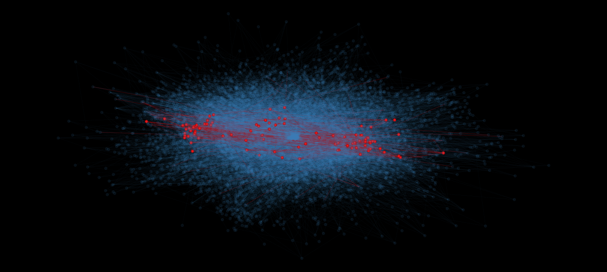
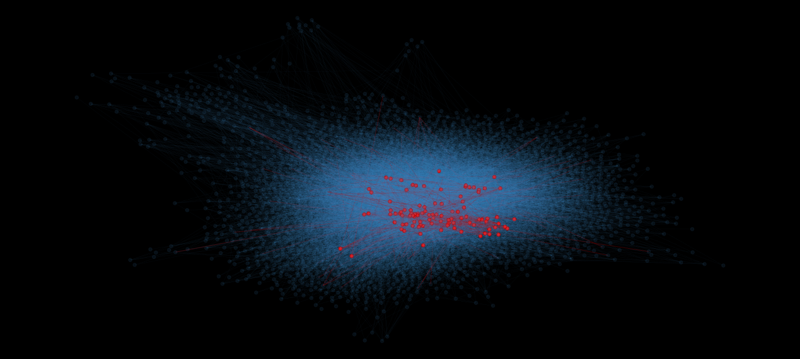
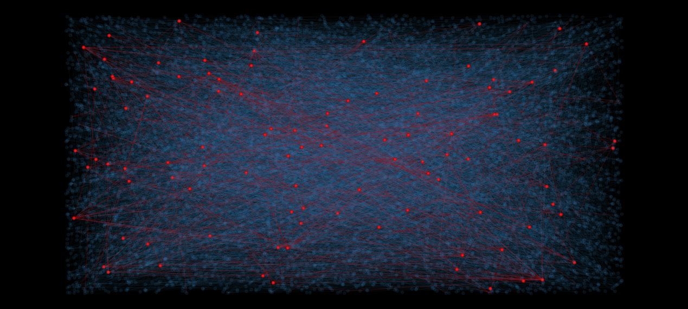
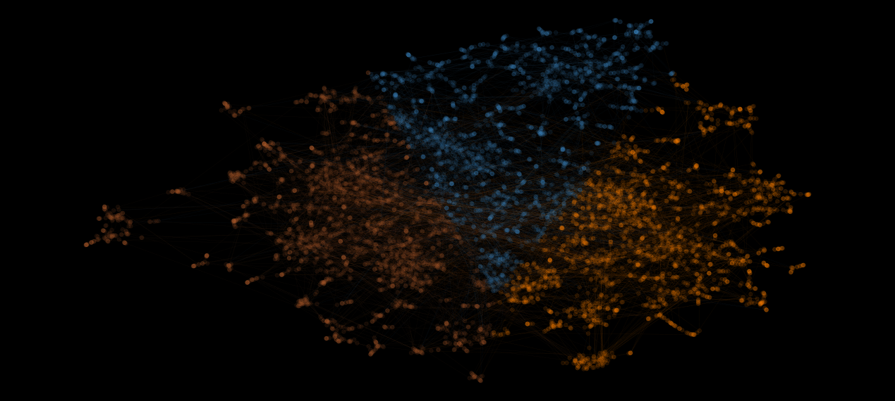

```{r setup, include=FALSE}
knitr::opts_chunk$set(echo = TRUE, warning = F, message = F)
```

### Introduction

Network is a way to represent information about relationship between observations. Network analysis is a big field of study rooted in discrete mathematics, with its own vocabulary and methodology. Its applications are numerous, from epidemiology, to marketing and sociology. In recent years, due to rise of social networking sites, the area of social dynamics is growing particularly fast.

Most of the standard methods of statistical analysis require the data to be in tabular format. However, sometimes it is not easy to obtain such structure. This is the case in network analysis. Storing the information in some standard format requires some dimensionality reduction technique. 

In this paper, I have presented available methods, both designed specifically for network analysis, and general dimension reduction tasks applicable to network data. I have applied these methods to data about similarities between polish musicians obtained from [last.fm](http://last.fm) site.


### Methods

#### Dimension reduction for the network data
One would wonder, why dimension reduction is necessary for network analysis.
One of the canonical ways to represent a graph is an adjacency matrix, in which each row and column represents one node (vertex), and in each cell of the matrix there is either 1 (vertices are connected) and 0 (vertices are not connected). Below is a picture presenting this concept. After presenting the graph in this way, it is tempting to follow standard data analysis path from this point, treating each row as an observation and each column as a feature. 




[(Source)](http://mathworld.wolfram.com/AdjacencyMatrix.html)

However, there are two problems with such setting. First thing is that this is a very high-dimensional data. Number of columns is equal to number of vertices in the graph, thus for a graph with n vertices one gets a huge n x n matrix. For sparse graphs (with much more vertices than edges) the matrix contains mostly zeros, which is problematic for some algorithms. 

Other non-trivial mistake present in this method is that from adjacency matrix one can obtain an information only about closest neighbor. In many cases, even not direct neighboring can carry important information about particular node.

As it is visible now, reducing dimensionality of the network data is sometimes necessary to do further analysis. That is, converting a specific representation of each vertex, with specified neighbors, to an abstract one, where each vertex is a point in a low-dimensional space. One should be aware, that the placement of each point in this space contains information about its placement in the original graph, however losing information about specific neighbors.

#### Graph plotting layouts computation

One of the areas in network analysis is graph plotting. Plotting the data is usually a first step of Exploratory Data Analysis, and as such, it was an important to develop reliable methods for network plotting. Actually, obtaining a layout of the network in 2D space (that is, x and y coordinates for each vertex on the plot) requires some dimensionality reduction technique. 

There are some well-defined criteria what constitutes a good network visualization. The most important ones, according to @kaufmann2003drawing, are:

1. Minimization of edge crossings
2. Even distribution of the elements
3. Minimization of edges length
4. Finding and preservation of symmetry between subgroups of nodes (displaying similar areas of the graph in the same way).

There is a family of plot layout creation techniques that give a good result called **force-directed layouts**. An underlying process for such techniques gets an inspiration from real-world physical systems. In the simulation, vertices are modeled as particles which are repulsing each other, and the edges act like elastic springs attracting particles to each other. 
Below I have included a simple demonstration of such system. After dragging highlighted vertex, other ones adjust to change.

```{r simulation-dragging}
library('visNetwork') 
library(igraph)
library(tidyverse)
library(factoextra)

nodes <- tribble(~id, ~color, ~label,
                1, NA, NA,
                2, NA, NA,
                3, "red", "Drag me",
                4, NA, NA
                )

edges <- tribble(~from, ~to,
                 1, 2,
                 2, 3,
                 1, 3,
                 3, 4
                 )

visNetwork(nodes, edges)
```

*For graph analysis the best R library is igraph [@igraph]. It provides huge amount of functions for graph manipulation, statistics and plotting. For interactive plotting, I have used visNetwork library [@visNetwork]. In later examples, I have saved  output from visNetwork as images, as interactive visualization is very resource-heavy.*

There are two most widespread force-directed layouts: **Fruchterman and Reingold** [-@fruchterman1991graph] algorithm, and **Kamada-Kawai** [-@kamada1989algorithm] one. Both use simulation close to the one described above. @kobourov2004force describes the difference like this: *"Whereas the algorithm of Fruchterman-Reingold aim to keep adjacent vertices close to each other while ensuring that vertices are not too close to each other, Kamada and Kawai take graph theoretic approach [...]. In this model, the “perfect” drawing of a graph would be one in which the pair-wise geometric distances between the drawn vertices match the graph theoretic pairwise distances."* ^[http://cs.brown.edu/people/rtamassi/gdhandbook/chapters/force-directed.pdf]

There is also another layout algorithm worth mentioning. Large-Graph-Layout [@adai2004lgl] is aimed specifically at drawing big (>1 million vertices) graphs. 


On the plot below, the same network is presented using different layouts.

```{r layouts-comparison, cache=T, fig.height=3}

net <- sample_pa(100) 
V(net)$size <- 8
V(net)$frame.color <- NA
V(net)$color <- "red"
V(net)$label <- "" 
E(net)$arrow.mode <- 0

par(mfrow = c(1, 4))
plot(net, layout = layout_randomly, main = "Random")
plot(net, layout = layout_with_fr, main = "Fruchterman-Reingold")
plot(net, layout = layout_with_kk, main = "Kamada-Kawai")
plot(net, layout = layout_with_lgl, main = "Large-Graph-Layout")


```


#### General Dimension reduction methods

For good layout computation, it is also possible to use standard dimension reduction algorithms. The main obstacle is that the method used should be able to use dissimilarity matrix instead of standard data frame. This means that PCA is not possible to use. 

In this analysis I have used two standard dimension reduction algorithms, that is Multi-Dimensional Scaling and t-distributed Stochastic Neighbor Embedding [@maaten2008visualizing]. The latter one is relatively new, and as such, requires some explanation. t-SNE is a method aimed specifically at visualizing high dimensional, non-linear data in 2- or 3-dimensional space. Basic intuition if the method is the same as in Multi-Dimensional Scaling algorithm. That is, trying to learn a representation of high dimensional points to smaller space by trying to preserve pairwise distances. T-SNE employs different distance metric, based on conditional probability of two points being neighbors. Explanation of inner workings of the algorithm is beyond the scope of this paper. For detailed presentation of the algorithm and its potential pitfalls, see [here](https://distill.pub/2016/misread-tsne/).

### Dataset description

*Disclaimer: I have used the same dataset in a group project for Applied Microeconomics class. The analysis done in this paper is unique. However, I have reused small part of below dataset description.*

The data used here was obtained using an open API provided by last.fm site. Last.fm is a service in which users are able to record music played by them using different services, including Spotify, YouTube, Tidal and others.
I have analyzed only a subset of polish artists. Available information about each artist is:

- Artist name
- Number of times particular artist was played by all users (playcount)
- Names of 5 most similar artists. 

Below I have loaded the the dataset and presented its initial structure. 

```{r load-data, cache=T}
# Load the data
temp <- new.env()
load("data/clean_datasets.Rdata", envir = temp)
general_info <- temp$general_info
similar_artists <- temp$similar_artists

```

#### {.tabset .tabset-fade}

##### Artist data

```{r}
general_info %>%
  arrange(-playcount) %>%
  head() %>%
  select(-listeners) %>%
  knitr::kable() %>%
  kableExtra::kable_styling()
```


##### Similar artists

```{r}
similar_artists %>%
  head(10) %>%
  select(-rank) %>%
  knitr::kable() %>%
  kableExtra::kable_styling()
```


####

I have used information about similar artists to construct a network of similarities between artists. For further analysis, I have excluded the vertices for artists, for which there is no further data available.   

Methods for layout computation presented above usually work better if the graph is connected. This means that it is possible to go from each vertex to any other vertex. As such, I have selected only the biggest connected subraph for later analysis. It has 6618 artists in total, so it captures majority of them. Also, it contains mostly artists which were played at least 1 time.

I have also made the graph undirected. That is, from information e.g. "Brodka is similar to Dawid Podsiadło", I got "Brodka and Dawid Podsiadło are similar". This step makes some analyses easier. Also, pairwise distances matrix should be symmetric to avoid surprises later on.


```{r clean-igraph, cache=T}
 
# Remove artists not avaliable in the database
similar_artists <- similar_artists %>%
  drop_na() %>%
  filter(similar %in% general_info$name) 

general_info %>%
  select(-listeners) -> general_info

# Create a graph
artist_graph <- graph_from_data_frame(similar_artists, 
                                vertices = general_info)

# Convert to undirected
artist_graph %>% 
  as.undirected(mode = "collapse") -> artist_graph

# Select biggest component of the graph
comp <- components(artist_graph)
biggest_subgraph <- delete_vertices(artist_graph, 
                                    V(artist_graph)[comp[["membership"]] != 1])

artist_graph <- biggest_subgraph

```


One quantitative information about each artist is playcount. Below I have shown playcount density plot. I have log-transformed the values for readability. As can be seen, playcount is highly right-skewed.

```{r hist-playcount, cache=T}

tibble(log_playcount = log(V(artist_graph)$playcount)) %>%
  mutate(log_playcount = ifelse(is.infinite(log_playcount), 0, log_playcount)) %>%
ggplot(aes(x = log_playcount)) +
  geom_histogram(fill = "#377EB8", alpha = 0.9) +
  labs(x = "log(playcount)") +
  theme_minimal(base_size = 17)
```


### Analysis

Below I have computed coordinates in 2-dimensional space using Fruchterman-Reingold, Kamada-Kawai, LGL, Random, MDS and t-SNE methods. For t-SNE and MDS methods, distance matrix is needed. Natural distance metric for a network is shortest path between two given vertices. Function ` igraph::distances` induces `Inf` value when there is no such path for particular vertices. As MDS can't operate on infinite values, I am converting these for large number. Last step is to rescale all coordinates to [-1, 1] range.

```{r compute-coords, eval=F}
# Fruchterman-Reingold
set.seed(10)
coords_fr <- layout_with_fr(artist_graph, niter = 5000)

#  Kamada-Kawai
set.seed(10)
coords_kk <- layout_with_kk(artist_graph)

# LGL
set.seed(10)
coords_lgl <- layout_with_lgl(artist_graph, maxiter = 500)

# Random
set.seed(10)
coords_rand <- layout_randomly(artist_graph)

# Create distance matrix
dist_graph <- distances(artist_graph)
dist_graph[is.infinite(dist_graph)] <- 1000000 # convert from infinity
dist_graph <- as.dist(dist_graph)

# MDS
set.seed(10)
coords_mds <- cmdscale(dist_graph)

# t-SNE
set.seed(10)
coords_tsne <- Rtsne::Rtsne(dist_graph, is_distance = T, pca = F)

save(coords_fr,
     coords_lgl,
     coords_rand,
     dist_graph,
     coords_mds,
     coords_tsne,
     file = "data/coords_computed.Rdata")
save(coords_kk, file = "data/coords_kk.Rdata")

```


```{r load-coordinates}
# Load the coordinates from file
load("data/coords_computed.Rdata")
load("data/coords_kk.Rdata")

# Extract result matrix from tsne
coords_tsne <- coords_tsne$Y

coords_fr <- norm_coords(coords_fr, xmin = -1, xmax = 1, ymin = -1, ymax = 1)
coords_lgl <- norm_coords(coords_lgl, xmin = -1, xmax = 1, ymin = -1, ymax = 1)
coords_rand <- norm_coords(coords_rand, xmin = -1, xmax = 1, ymin = -1, ymax = 1)
coords_mds <- norm_coords(coords_mds, xmin = -1, xmax = 1, ymin = -1, ymax = 1)
coords_tsne <- norm_coords(coords_tsne, xmin = -1, xmax = 1, ymin = -1, ymax = 1)
coords_kk <- norm_coords(coords_kk, xmin = -1, xmax = 1, ymin = -1, ymax = 1)


```


*One thing worth mentioning is that MDS method is very slow. It's cubic time complexity makes it unreasonable to run on even moderate datasets. For example, above computation took ~1 hour on my computer. This is for ~6 000 observations. Cubic running time means that if I would double the observation count, running the algorithm would take 8 times longer. One should be aware that for really big graphs with millions of vertices, it does make sense to actually operate on vertices and edges densities rather than actual position, as human eye can't operate in such detail.*


One consideration when using dimensionality reduction of any kind is which technique is the best the one. There is no algorithm-agnostic method of comparison between the results, and thus results can be subjective. I have decided to check, which layout presents some meaningful information about popular artists. I have highlighted the top 100 artists. 

#### {.tabset .tabset-fade}

##### t-SNE


##### Multi-Dimensional Scaling


##### Fruchterman-Reingold


##### Kamada-Kawai


##### Large Graph Layout


##### Random


####

After manually inspecting the graphs, it is visible that in t-SNE, MDS and F-R methods, these artists are laying close to each other. 
It is an indication that prediction of popularity using the graph layout as the features may give promising results.
The rest of layouts do not show such results. 

As the network has its representation in lower-dimensional space, next analyses are fairly easy. From this point, curious researcher can go to prediction, visualization, exploratory analysis or anything else he wishes.

For demonstration purposes, I have decided to run a simple clustering analysis on the coordinates obtained by t-SNE method.
I have run k-means algorithm. By criterion of maximum silhouette, the best number of clusters is 3.

```{r silhouette, cache=T, fig.height=3, fig.width=5}
coords_df <- as_tibble(coords_tsne)
fviz_nbclust(coords_df, kmeans, method = "silhouette") +
  theme_minimal()
```

I have compared playcounts for each of the clusters. On below density plots, the playcount was logarithmed for clarity. The densities look similar at the first sight. However, in cluster 2 the right tail is bigger than in other ones. This means that in this cluster most popular artists are more represented. Same is visible in quantile analysis. 75% playcount quantile for cluster 2 is 3.4 times bigger than in "the least popular" cluster 3.

#### {.tabset .tabset-fade}

##### Density plot
```{r hist-clusters, cache = T}
set.seed(10)
km <- kmeans(coords_df, centers = 3)


coords_df %>%
  mutate(cluster = as.character(km$cluster),
         playcount = V(artist_graph)$playcount,
         artist = V(artist_graph)$name) -> df

potential_colors <- adjustcolor(RColorBrewer::brewer.pal(8, "Set1"), alpha.f = 0.1)
ggplot(df, aes(x = log(playcount), fill = cluster)) +
  scale_fill_manual(values = potential_colors[c(2,5,7)]) +
  geom_density(alpha = 0.7) +
  facet_grid(rows = vars(cluster)) +
  theme_minimal()

```

##### Quantiles table
```{r quantiles, cache=T}
df %>% 
  group_by(cluster) %>%
  summarise(`25%` = quantile(playcount, 0.25),
            `50%` = quantile(playcount, 0.5),
            `75%` = quantile(playcount, 0.75),
            `95%` = quantile(playcount, 0.95)) %>%
  knitr::kable() %>%
  kableExtra::kable_styling()

```

####


I have added cluster coloring to a graph. This does not give any valuable information at first sight, but can be used for later analysis.




### Summary

In this paper I have presented usage of various dimensionality reduction techniques for network analysis. I have shown that after this procedure, it is possible to apply next analytics steps, such as plotting and clustering.

### References